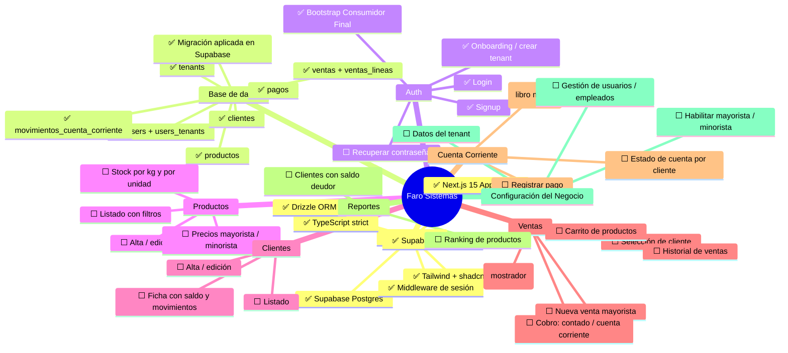

# Mapa Conceptual — Faro Sistemas

> Actualizado automáticamente con cada avance. Estado al 2026-05-08.

---

## Estado por módulo

| Módulo | Estado | Detalle |
|---|---|---|
| Infraestructura | ✅ Completo | Stack armado, config lista |
| Base de datos | ✅ Completo | 9 tablas, migración aplicada |
| Auth | ✅ Completo | Login, signup, onboarding, bootstrap Consumidor Final |
| Productos | ⬜ Pendiente | — |
| Clientes | ⬜ Pendiente | — |
| Ventas | ⬜ Pendiente | — |
| Cuenta Corriente | ⬜ Pendiente | — |
| Reportes | ⬜ Pendiente | — |
| Config del negocio | ⬜ Pendiente | — |

---

## Leyenda
- ✅ Completo
- 🔄 En progreso
- ⬜ Pendiente
