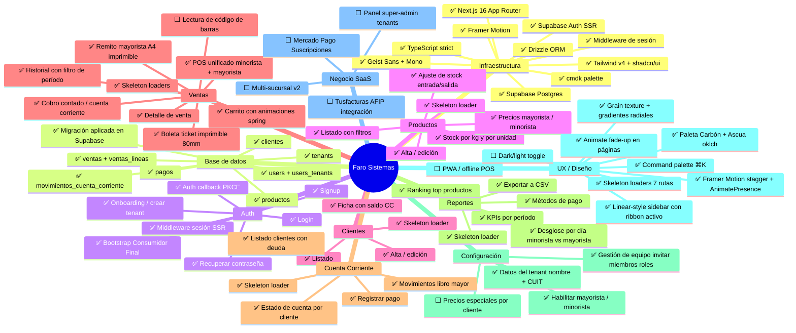

# Mapa Conceptual — Faro Sistemas

> Actualizado 2026-05-09 (v3).

---

## Estado por módulo

| Módulo | Estado | Detalle |
|---|---|---|
| Infraestructura | ✅ Completo | Stack full, fonts, animations, palette |
| Base de datos | ✅ Completo | 9 tablas, migración aplicada |
| Auth | ✅ Completo | Login, signup, onboarding, reset, callback PKCE |
| Productos | ✅ Completo | Listado, CRUD, stock, ajuste |
| Clientes | ✅ Completo | Listado, CRUD, ficha CC |
| Ventas | 🔄 95% | Falta barcode scanner |
| Cuenta Corriente | ✅ Completo | Movimientos, pagos, saldo |
| Reportes | ✅ Completo | KPIs, ranking, métodos de pago, desglose diario, export CSV |
| Config negocio | 🔄 85% | Equipo listo, falta precios por cliente |
| UX / Diseño | 🔄 90% | Falta PWA |
| Negocio SaaS | ⬜ Pendiente | Todo el monetization layer |

---

## Próximos pasos — orden sugerido

### 🔴 Corto plazo (impacto inmediato en usabilidad)

| # | Feature | Estado |
|---|---|---|
| 1 | **Boleta / ticket imprimible** | ✅ Implementado — ticket 80mm (minorista) + remito A4 (mayorista) |
| 2 | **Recuperar contraseña** | ✅ Implementado — forgot + reset + middleware PKCE |
| 3 | **Gestión de empleados** | ✅ Implementado — lista, invitar por email, roles owner/admin/empleado |

### 🟡 Medio plazo (completar el producto)

| # | Feature | Por qué |
|---|---|---|
| 4 | **Exportar reportes a CSV** | ✅ Implementado — descarga CSV con resumen, ventas por día, métodos de pago y top productos |
| 5 | **Precios especiales por cliente** | Mayoristas con acuerdos puntuales tienen precios distintos al general. |
| 6 | **PWA / mobile POS** | Usar desde tablet en mostrador sin instalar nada. |
| 7 | **Lectura de código de barras** | Acelera 10× el ingreso de productos en caja. |

### 🟢 Largo plazo (monetization y escala)

| # | Feature | Por qué |
|---|---|---|
| 8 | **Panel super-admin** | Gestionar tenants, ver métricas cross-tenant, activar/suspender planes. |
| 9 | **Mercado Pago Suscripciones** | Cobro automático a tenants — sin esto no es un negocio. |
| 10 | **Tusfacturas / AFIP** | Factura electrónica para que los tenants facturen a sus clientes. |
| 11 | **Multi-sucursal** | Un solo tenant con múltiples locales. Stock separado por sucursal. |

---

## Leyenda
- ✅ Completo
- 🔄 En progreso / parcial
- ⬜ Pendiente
